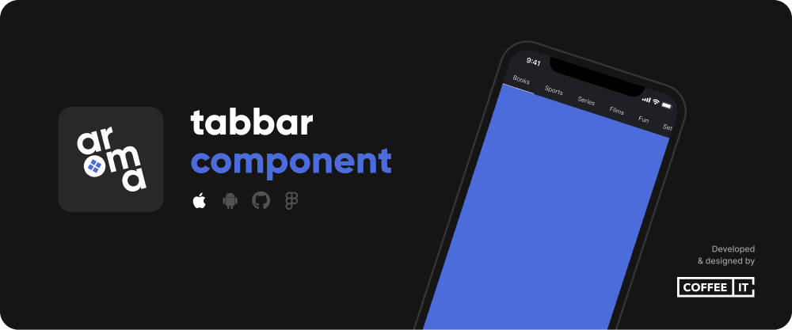
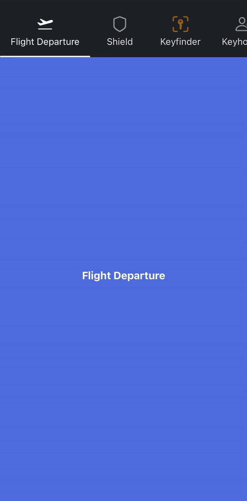

[](https://coffeeit.nl/)

[](https://img.shields.io/badge/Swift-5.6-red?style=flat-square)
[](https://img.shields.io/badge/iOS-v14+-pink?style=flat-square)
[](https://img.shields.io/badge/Mirror-Repository-pink?style=flat-square)
[](LICENSE.md)
[](https://img.shields.io/badge/Swift_Package_Manager-Compatible-red?style=flat-square)
[](https://linkedin.com/company/coffee-it)
[](https://www.facebook.com/CoffeeITNL/)
[](https://www.instagram.com/coffeeitnl/)
[](https://twitter.com/coffeeitnl)

The CITTopTabBar package provides a stylized tab bar used to switch between different detail views. It comes with several customization options and useful features like loyalty to center position, built-in animations, swipe/page-ability and notification badges with optional numbers.

<p float="left">
    
</p>

## ⚡ Installation

This component requires minimum __iOS 14__.

### 🔨 SwiftPM

To install the Swift Package, go to Project > Package Dependencies > + > Search or Enter Package URL > Fill in:
```
https://github.com/Coffee-IT-Development/TopTabBar-iOS-Component
```

## 📖 Usage

Import CITTopTabBar and add a CITTopTabBarView to your SwiftUI view.
Best used in combination with a page style TabView.

```swift
import CITTopTabBar
import SwiftUI

struct CITTopTabBarExampleView: View {
    @State var selectedTab: Int = 0
    @State var tabs: [CITTopTab] = [
        .init(
            title: "Flight Departure",
            icon: .init(systemName: "airplane.departure")
        ),
        .init(title: "Shield", icon: .init(systemName: "shield")),
        .init(
            title: "Keyfinder",
            icon: .init(systemName: "key.viewfinder"),
            iconColorOverride: .orange.opacity(0.5),
            selectedIconColorOverride: .orange
        ),
        .init(
            title: "Keyholder",
            icon: .init(systemName: "person.badge.key"),
            badge: .circle(style: .init(color: .tabBarTextColor, position: .leading)),
            removeBadgeOnTabSelected: true
        ),
        .init(
            title: "Films",
            icon: .init(systemName: "film"),
            badge: .circle(style: .init(color: .tabBarTextColor, position: .trailing))
        ),
        .init(title: "Lasso", icon: .init(systemName: "lasso.and.sparkles")),
        .init(title: "Gaming", icon: .init(systemName: "gamecontroller")),
        .init(title: "Library", icon: .init(systemName: "books.vertical")),
        .init(title: "Questions", icon: .init(systemName: "questionmark.app.dashed"))
    ]
    
    var config: CITTopTabBarView.Configuration {
        var example: CITTopTabBarView.Configuration = .exampleUnderlined
        example.textColor = .tabBarTextColor
        example.backgroundColor = .tabBarBackgroundColor
        return example
    }
    
    var body: some View {
        VStack {
            CITTopTabBarView(selectedTab: $selectedTab, tabs: $tabs, config: config)
            
            TabView(selection: $selectedTab) {
                ForEach(Array(tabs.enumerated()), id: \.offset) { offset, tab in
                    Text(tab.title)
                        .font(.system(size: 16, weight: .bold))
                        .tag(offset)
                }
            }
            .tabViewStyle(.page(indexDisplayMode: .never))
            .edgesIgnoringSafeArea(.all)
        }
        .background(Color.coffeeItColor)
        .preferredColorScheme(.dark)
        .edgesIgnoringSafeArea(.all)
    }
}
```

## ⚙️ Customization

```swift
/// The backgroundColor of the entire tab bar if not overlayed by anything else,
public var backgroundColor: Color

/// The backgroundColor of the currently selected tab, if not given, defaults to clear color.
/// Does not always display correctly in preview, but works as intended at runtime on a phsycial device.
public var selectedBackgroundColor: Color

/// The text color of tabs that are currently not selected, can be used to apply a simple color for all tab items regardless of selection, like black.
/// Or if selection is relevant, often used to choose an inactive tab text color like a faded gray.
public var textColor: Color

/// The text color of the currently selected tab, if not given, defaults to textColor.
public var selectedTextColor: Color

/// The size of any icons shown in the tabbar if not overridden.
public var iconSize: CGSize

/// The color of icons in unselected tabs if not overridden.
public var iconColor: Color

/// The position of icons in tabs, defaults to `top`.
public var iconPosition: CITTopTabIconPosition

/// The color of icons in the selected tab if not overridden.
public var selectedIconColor: Color

/// The spacing below the icon if any icons are shown, e.g. between the icon and the text.
public var spacingBelowIcon: CGFloat

/// The displayMode is used to select whether the CITTopTabBarView should be shown at the top of the screen or somewhere else.
/// If .atTopOfScreen is selected, the top safe area will be ignored and filled with the given backgroundColor.
/// - In this case, topPadding can be used to adjust the inset from the top of the screen.
public var displayMode: CITTopTabBarDisplayMode

/// The widthMode is used  to select whether the CITTopTabBarView should be scrollable or fill up the given space and give tabs an equal, fixed width.
public var widthMode: CITTopTabBarWidthMode

/// The font used to display tab titles.
public var font: Font

/// The line limit for titles in every tab. If `nil`, no line limit applies. Defaults to `1`.
public var lineLimit: Int?

/// Used to add insets to the entire tabbar, commonly used to add horizontal padding to the scrollable content so it doesn't touch the sides in its initial state.
public var tabBarInsets: EdgeInsets

/// Used to add insets to each tab's content, may be used to increase the size of underlines and simultaneously spacing tabs apart.
/// If you want to negate the effect this has on the underline's size, adjust the underlineInsets accordingly.
public var tabContentInsets: EdgeInsets

/// Minimum width of a single tab. If `nil`, no minimum width applies. Defaults to `90`.
public var tabViewMinWidth: CGFloat?

/// Used to add insets to the underline, may be used to increase spacing between tab content and underline, add bottom padding to the underline, or make it smaller.
/// If you want to make the underline larger, avoid using negative padding, use tabContentInsets or underlineHeight instead.
public var underlineInsets: EdgeInsets

/// Used to add insets to the currently selected tab, may be used to achieve effects like raising the selected item, try the value ".init(top: 0, leading: 0, bottom: 10, trailing: 0)".
/// This effect works the best if all tabs have equal height, weird behaviour may occur if you have active notification badges with irregular height, see CITNotificationBadgeStyle.
public var selectedInsets: EdgeInsets

/// Used to add insets to the currently selected tab's background if any.
public var selectedBackgroundInsets: EdgeInsets

/// Used to set visibility of the underline, defaults to true.
public var showUnderline: Bool

/// The color of the underline, if not given, defaults to selectedTextColor.
public var underlineColor: Color

/// The height of the underline, defaults to 2px.
public var underlineHeight: CGFloat

/// The corner radius of the underline, affects how much its corners are rounded, defaults to infinity, i.e. maximum rounding.
public var underlineCornerRadius: CGFloat

/// The animation applied to the top tab view, applies to all of its content, but most noticably affects the underline and background matchedGeometry animations.
public var tabAnimation: Animation?

/// The corner radius of the currently selected tab's background, only visible if a selectedBackgroundColor is given.
/// To achieve a pill shape like selection, try .infinity and setting showUnderline to false.
/// If you experience a lack of tab content padding with regards to its selected background, check your values for "tabContentInsets" vs "selectedBackgroundInsets" as the latter may negate the former.
public var selectedBackgroundCornerRadius: CGFloat

/// Used to show a border on all unselected or not.
public var showBorderWhileUnselected: Bool

/// The width of unselected borders, defaults to `2px`.
public var unselectedBorderWidth: CGFloat

/// The color of unselected borders, defaults to selectedBackgroundColor.
public var unselectedBorderColor: Color

/// The spacing between each tab item, defaults to `0px`.
public var tabViewSpacing: CGFloat

/// Used to adjust spacing between a tab's title and its notification badge if any, defaults to 8px.
public var titleToBadgeSpacing: CGFloat

/// Internal only: used to calculate the correct height for tabs when taking selectedInsets into consideration.
/// This is what allows for minimal movement when switching between tabs if a selectedBackgroundColor is used without breaking the expected behavior of the matchedGeometryEffect.
/// Note, this may no longer be necessary in the future if Apple improves the use of matchedGeometryEffect in .background() modifiers.
public var verticalSelectedInset: CGFloat

/// Returns optional top padding to make room for the status bar based on the displayMode.
public var ignoreSafeEdgeTopPadding: CGFloat

/// Returns displayMode as a boolean value to handle wether tab bar should be shown at the top of the view or not.
public var showAtTopOfScreen: Bool
```

## 🔗 Related publications

Look at our other repositories on our [GitHub account](https://github.com/orgs/Coffee-IT-Development/repositories).

## ✏️ Changelog

All notable changes to this project will be documented in the [Changelog](CHANGELOG.md).
`CITTopTabBar` adheres to [Semantic Versioning](https://semver.org/).

## 📧 Contact

Do you have questions, ideas or need help? Send us an email at contact@coffeeit.nl.

<picture>
  <source media="(prefers-color-scheme: dark)" srcset="https://global-uploads.webflow.com/605a171ee93af49275331843/623b23cdea80a92703e61b42_Logo_black_1.svg" width="100">
  <source media="(prefers-color-scheme: light)" srcset="https://coffeeit.nl/wp-content/uploads/2016/09/logo_dark_small_new.png" width="100">
  
</picture>

## ⚠️ License

The Aroma TopTabBar package is licensed under the terms of the [MIT Open Source license, combined with the Commons Clause licence](LICENSE.md).
